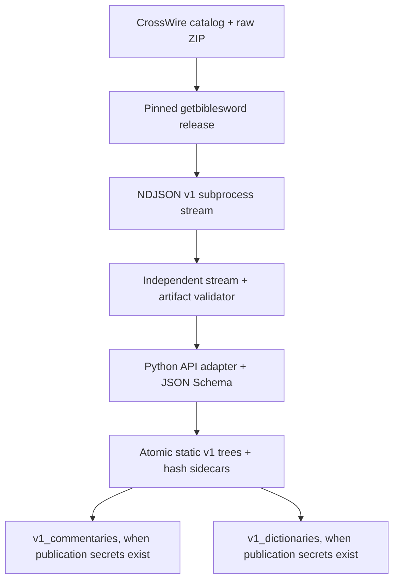

# GetBible Study Builder v1

[](https://github.com/getbible/v1_study_builder/actions/workflows/build.yml) [](https://github.com/getbible/v1_study_builder/actions/workflows/ci.yml) [](https://github.com/getbible/v1_study_builder/actions/workflows/binary-smoke.yml) [](https://github.com/getbible/v1_study_builder/actions/workflows/integration.yml)

`v1_study_builder` converts policy-approved CrossWire SWORD commentary and
dictionary modules into two independently deployable static JSON APIs:

- `https://commentaries.getbible.net/v1/` from `getbible/v1_commentaries`
- `https://dictionaries.getbible.net/v1/` from `getbible/v1_dictionaries`

The Bible API v3 builder remains unchanged. Study Builder deliberately uses the
same book numbers, chapters, verses, and Strong's keys so a client can move from a
Bible response to commentary or dictionary data with a direct path lookup.

## Repository boundaries

| Repository | Responsibility | Runtime |
| --- | --- | --- |
| `getbible/getbiblesword` | Official SWORD C++ extraction and deterministic NDJSON | Released Linux executable |
| `getbible/v1_study_builder` | Download policy, strict contract validation, normalization, schemas, and publication | Python 3.12 at build time |
| `getbible/v1_commentaries` | Generated commentary JSON under `v1/` | Nginx/CDN only |
| `getbible/v1_dictionaries` | Generated dictionary JSON under `v1/` | Nginx/CDN only |

Study Builder does not contain C++, link `libsword`, use a Python SWORD binding, or
parse a module's binary driver format. `getbiblesword` is a separately versioned
subprocess dependency.

## Extraction dependency

`conf/getbiblesword.json` pins release `v0.1.1`, contract
`getbiblesword.ndjson/v1`, and the exact x86-64/ARM64 Linux asset names and
SHA-256 digests. On first use the builder:

1. constructs the direct public download URL for the pinned tag and asset;
2. downloads the architecture-specific archive without calling the GitHub API;
3. verifies it against the SHA-256 digest committed in the manifest;
4. safely extracts only `usr/bin/getbiblesword`;
5. checks the executable's reported version and contract;
6. caches it under `.work/tools/getbiblesword/0.1.1/`.

The `getbible/getbiblesword` repository and its pinned release are public, so
installation requires no repository token or GitHub API request. The automated
smoke, integration, and production builds all exercise this unauthenticated path.

Install or verify it explicitly:

```bash
study-builder engine install
study-builder engine verify
```

An audited local executable can be selected with `--engine /absolute/path` or
`STUDY_BUILDER_GETBIBLESWORD`; it must still report the pinned version and contract.

## Independent contract validation

The builder treats extractor output as untrusted. It reads NDJSON incrementally
and independently checks all of the rules that protect publication:

- `getbiblesword.ndjson/v1` header and extract command;
- canonical top-level member order and zero-based monotonic sequence values;
- base64 decoding, byte size, SHA-256, and matching UTF-8 convenience fields;
- entry/configuration ordinals and module classification;
- artifact identifiers, chunk indexes, reconstructed size, and SHA-256;
- exact stream SHA-256 over every line before the footer, including LF;
- exact footer record/entry/artifact/byte counts and `success: true`.

Raw bytes remain authoritative. The adapter derives safe text/HTML for the public
API only after verification and retains the original contract records internally.
Any missing footer, checksum failure, failed diagnostic, extractor error, or
classification mismatch stops the complete build before publication.

## Commentary API

```text
GET https://commentaries.getbible.net/v1/commentaries.json
GET https://commentaries.getbible.net/v1/{commentary}/metadata.json
GET https://commentaries.getbible.net/v1/{commentary}/books.json
GET https://commentaries.getbible.net/v1/{commentary}/{book}.json
GET https://commentaries.getbible.net/v1/{commentary}/{book}/{chapter}.json
```

The chapter path is the primary high-volume endpoint. `book` is the GetBible API
v3 numeric identifier: Genesis is `1`, Matthew `40`, and Revelation `66`. Each
entry contains its natural Bible coordinate:

```json
{
  "schema": "getbible-commentary-chapter-v1",
  "commentary": "clarke",
  "language": "en",
  "book": 43,
  "name": "John",
  "chapter": 1,
  "entries": [
    {
      "book": 43,
      "chapter": 1,
      "verse": 1,
      "name": "John 1:1",
      "anchor": {"book": 43, "chapter": 1, "verse": 1, "osis": "John.1.1"},
      "text": "...",
      "html": "<p>...</p>"
    }
  ]
}
```

Book and chapter introductions use chapter or verse `0`; they are not discarded.

## Dictionary API

```text
GET https://dictionaries.getbible.net/v1/dictionaries.json
GET https://dictionaries.getbible.net/v1/{dictionary}/metadata.json
GET https://dictionaries.getbible.net/v1/{dictionary}/keys.json
GET https://dictionaries.getbible.net/v1/{dictionary}/{entry}.json
GET https://dictionaries.getbible.net/v1/{dictionary}/indexes/{sha256-prefix}.json
```

Strong's paths match Bible API v3 tokens directly:

```text
G3056 -> https://dictionaries.getbible.net/v1/strongsgreek/G3056.json
H0430 -> https://dictionaries.getbible.net/v1/strongshebrew/H0430.json
```

Greek keys use `G` plus the unpadded number; Hebrew keys use `H0` plus the
unpadded number. Other dictionary keys receive deterministic, path-safe IDs.
`keys.json` maps source keys and aliases, while 256 SHA-256-prefix shards provide
smaller lookup indexes for constrained clients.

Some SWORD dictionaries legitimately contain more than one definition for the
same public key. The first definition keeps the canonical direct path, and later
definitions receive deterministic `--2`, `--3`, and subsequent suffixes. For
example, Easton's repeated `KADESH` records are available as `k-KADESH.json` and
`k-KADESH--2.json`. Every definition appears in `keys.json` with an `occurrence`
value. Dictionary metadata reports both the total `entry_count` and the distinct
`unique_key_count`.

## Build flow



The static output is the system of record. Nginx and a CDN can serve direct
lookups without an application process, database connection pool, or request
throttling bottleneck.

## Local development

```bash
python3.12 -m venv .venv
source .venv/bin/activate
python -m pip install -e '.[dev]'

study-builder engine install
python -m ruff check src tests scripts
python -m ruff format --check src tests scripts
python -m pytest
```

Inspect current redistribution decisions without downloading module packages:

```bash
study-builder catalog
study-builder catalog --resource dictionaries --json
```

Build both resources into `dist/`:

```bash
study-builder build --resource all
```

Build and validate one module without publication:

```bash
study-builder build --resource commentaries --module Clarke --refresh
python scripts/validate_build.py --resource commentaries --module Clarke
```

Partial module builds are deliberately prohibited from `--push`. A complete local
publication run is:

```bash
study-builder build --resource all --pull --push
```

Use `--offline` only after catalog and package caches exist. Use `--dry-run` to
show approved work without downloading packages or installing the extractor.

## Automation

| Workflow | Trigger | Result |
| --- | --- | --- |
| `ci.yml` | pull request, branch push, manual | Ruff, formatting, unit tests, malicious-contract rejection, CLI checks |
| `binary-smoke.yml` | relevant pull request, main push, manual | Public release install/verification plus real Clarke and StrongsGreek JSON builds |
| `integration.yml` | monthly, manual | Real builds of Clarke, TSK, MHCC, StrongsGreek, StrongsHebrew, and Easton; validates static lookup shape |
| `build.yml` | monthly, manual | Complete selected resource build; conditionally signs and pushes both output repositories |

The production workflow always builds. It pushes only when the `push` input is
enabled and all six publication values are non-empty. With incomplete publication
secrets it emits a notice, produces the local build and report, and skips Git setup,
cloning, commits, and pushes.

No extractor-access secret is required. `binary-smoke.yml` proves that the pinned
public release can be installed, verified, and used without authentication.

Publication secret set:

| Secret | Purpose |
| --- | --- |
| `GETBIBLE_GIT_USER` | Commit author name |
| `GETBIBLE_GIT_EMAIL` | Commit author email |
| `GETBIBLE_GPG_KEY` | ASCII-armored signing private key |
| `GETBIBLE_GPG_USER` | Signing identity |
| `GETBIBLE_SSH_KEY` | SSH private key with write access to both outputs |
| `GETBIBLE_SSH_PUB` | Matching public key |

The default output remotes are `getbible/v1_commentaries` and
`getbible/v1_dictionaries`. Optional `GETBIBLE_COMMENTARIES_REPO` and
`GETBIBLE_DICTIONARIES_REPO` secrets may select staging remotes.

## Redistribution policy

CrossWire availability is not permission to republish a transformed module.
`conf/module_policy.json` is fail-closed: explicit denial wins, reviewed module
approval may opt in a module, and otherwise only exact allowlisted license values
are built. Unknown or missing licenses are skipped. Generated metadata retains the
module's license, copyright, holder/contact, text source, and distribution notes.

## Docker

```bash
docker build -t getbible-study-builder:1 .
docker run --rm \
  -v "$PWD/dist:/app/dist" \
  getbible-study-builder:1 build --resource all
```

The public pinned extractor is downloaded and verified at runtime, then cached if
`.work/` is mounted.

## License

The Study Builder source is GPL-2.0-only. `getbiblesword` is distributed separately
under GPL-2.0-only with its corresponding SWORD source release. SWORD modules remain
separate works under their individual licenses.
