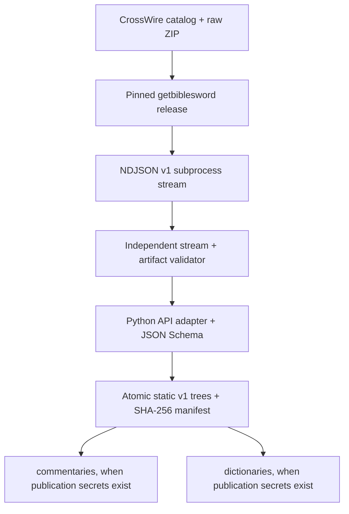

# GetBible Study Builder v1

[](https://github.com/getbible/v1_study_builder/actions/workflows/build.yml) [](https://github.com/getbible/v1_study_builder/actions/workflows/ci.yml) [](https://github.com/getbible/v1_study_builder/actions/workflows/binary-smoke.yml) [](https://github.com/getbible/v1_study_builder/actions/workflows/integration.yml)

`v1_study_builder` converts policy-approved CrossWire SWORD commentary and
dictionary modules into two independently deployable static JSON APIs:

- `https://commentaries.getbible.net/v1/` from `getbible/commentaries`
- `https://dictionaries.getbible.net/v1/` from `getbible/dictionaries`

The Bible API v3 builder remains unchanged. Study Builder deliberately uses the
same book numbers, chapters, verses, and Strong's keys so a client can move from a
Bible response to commentary or dictionary data with a direct path lookup.

Every document is plain text. Nothing in either API publishes HTML, so a consuming
application never has to sanitize a response before rendering it.

## Repository boundaries

| Repository | Responsibility | Runtime |
| --- | --- | --- |
| `getbible/getbiblesword` | Official SWORD C++ extraction and deterministic NDJSON | Released Linux executable |
| `getbible/v1_study_builder` | Download policy, strict contract validation, normalization, schemas, and publication | Python 3.12 at build time |
| `getbible/librarian` (`getbible` on PyPI) | Scripture reference engine: book-name tables and parser behind `query.getbible.net` | Python library at build time |
| `api.getbible.net/v2` | The Bible itself: which books, chapters, and verses each translation has, and what a language calls the books | Read at build time, cached |
| `getbible/commentaries` | Generated commentary JSON under `v1/` | Nginx/CDN only |
| `getbible/dictionaries` | Generated dictionary JSON under `v1/` | Nginx/CDN only |

Study Builder does not contain C++, link `libsword`, use a Python SWORD binding, or
parse a module's binary driver format. `getbiblesword` is a separately versioned
subprocess dependency. Nor does it carry its own idea of the Bible: the shape of the
books and the spellings of their names come from the Bible API and the librarian, the
same sources every other GetBible service reads.

## Extraction dependency

`conf/getbiblesword.json` pins release `v0.1.1`, contract
`getbiblesword.ndjson/v1`, and the exact x86-64/ARM64 Linux asset names and
SHA-256 digests. On first use the builder:

1. constructs the direct public download URL for the pinned tag and asset;
2. downloads the architecture-specific archive without calling the GitHub API;
3. verifies it against the SHA-256 digest committed in the manifest;
4. safely extracts only `usr/bin/getbiblesword`;
5. checks the executable's reported version and contract;
6. caches it under `.work/tools/getbiblesword/0.1.1/`.

The `getbible/getbiblesword` repository and its pinned release are public, so
installation requires no repository token or GitHub API request. The automated
smoke, integration, and production builds all exercise this unauthenticated path.

Install or verify it explicitly:

```bash
study-builder engine install
study-builder engine verify
```

An audited local executable can be selected with `--engine /absolute/path` or
`STUDY_BUILDER_GETBIBLESWORD`; it must still report the pinned version and contract.

## Bible API dependency

Every scripture reference the builder publishes is a coordinate in the Bible API, so
whether a coordinate exists is decided by the API, not by a table in this repository.
Before a module is written, the builder reads from `https://api.getbible.net/v2`:

1. `translations.json`, to know each translation's language and versification;
2. `{translation}/books.json`, for the numbered book names of the translations it uses;
3. `{translation}.json` and `{translation}.sha`, once per translation, from which it keeps
   only how many chapters each book has and how many verses each chapter has.

No scripture text is published or kept. The shape is cached under `.work/bible/` with
the hash it was downloaded under, and on every online build the hash is read again and
the shape refreshed when it changed, which is what the API's cache policy asks of every
consumer. `--offline` uses the cache alone.

A module is matched to translations by its `Versification` (`KJV` when it states none):
the best translation in that versification, preferably in the module's language, plus its
Apocrypha variant (`kjva` beside `kjv`) so deuterocanonical citations resolve. Book names
for the published `ref` come from a translation in the module's own language, so a
Swedish module cites `Andra Moseboken 30:34` and a Vietnamese one `Ma-thi-ơ 24:12`. Each
module's `metadata.json` records the choice under `references`.

`--bible-api` (or `STUDY_BUILDER_BIBLE_API`) points the builder at another API root, or at
a directory with the same layout; the tests run against such a directory.

## Independent contract validation

The builder treats extractor output as untrusted. It reads NDJSON incrementally
and independently checks all of the rules that protect publication:

- `getbiblesword.ndjson/v1` header and extract command;
- canonical top-level member order and zero-based monotonic sequence values;
- base64 decoding, byte size, SHA-256, and matching UTF-8 convenience fields;
- entry/configuration ordinals and module classification;
- artifact identifiers, chunk indexes, reconstructed size, and SHA-256;
- exact stream SHA-256 over every line before the footer, including LF;
- exact footer record/entry/artifact/byte counts and `success: true`.

Raw bytes remain authoritative. The adapter derives the public plain text only
after verification and retains the original contract records internally.
Validated entries are held in a compressed, disk-backed spool. Commentary entries
are then normalized into disk-backed chapter buckets, collapsed so that a comment
attached to a verse range is stored once rather than once per verse, and emitted in
canonical GetBible book/chapter order; this supports source modules whose versification
orders canonical or deuterocanonical books differently. Dictionary definitions are written
one at a time. Book, whole-commentary, and whole-dictionary documents are streamed
from the documents they contain rather than assembled in memory. This keeps memory
bounded for large modules without weakening the contract or the all-or-nothing
publication rule. Any missing footer, checksum failure, failed diagnostic,
extractor error, or classification mismatch stops the complete build before
publication.

## Commentary API

```text
GET https://commentaries.getbible.net/v1/commentaries.json
GET https://commentaries.getbible.net/v1/{commentary}.json
GET https://commentaries.getbible.net/v1/{commentary}/metadata.json
GET https://commentaries.getbible.net/v1/{commentary}/books.json
GET https://commentaries.getbible.net/v1/{commentary}/{book}.json
GET https://commentaries.getbible.net/v1/{commentary}/{book}/{chapter}.json
```

`book` is the GetBible API v3 numeric identifier: Genesis is `1`, Daniel `27`,
Matthew `40`, and Revelation `66`. Deuterocanonical books continue to `83`.

The three content levels are self-similar. A chapter document is one member of a
book document, which is one member of a whole-commentary document, embedded
byte-for-byte. One client parser therefore handles all three:

```text
{commentary}/{book}/{chapter}.json    one chapter, the high-volume endpoint
{commentary}/{book}.json             every chapter of that book
{commentary}.json                    every book of that commentary
```

```json
{
  "schema": "getbible-commentary-chapter-v1",
  "commentary": "clarke",
  "language": "en",
  "book": 43,
  "name": "John",
  "chapter": 1,
  "entries": [
    {
      "book": 43,
      "chapter": 1,
      "verse": 1,
      "osis": "John.1.1",
      "text": "...",
      "references": [{"ref": "Genesis 1:1", "osis": "Gen.1.1", "book": 1, "chapter": 1, "verse": 1}]
    }
  ]
}
```

### One comment, stored once

A SWORD commentary attaches a comment to a verse *range*, and the extractor reports
that same text once for every verse in the range. Publishing an entry per verse
stored the identical paragraph dozens of times — Augustine's exposition of a psalm
reappeared under all 176 verses of Psalm 119, and the whole-commentary documents grew
into the hundreds of megabytes without carrying any more text.

Each distinct comment is therefore published **once**, anchored at the lowest verse it
covers. When it covers more than one verse, `verses` lists every verse it applies to:

```json
{
  "book": 19,
  "chapter": 119,
  "verse": 1,
  "verses": [1, 2, 3, 4, 5, 6, 7, 8],
  "osis": "Ps.119.1",
  "text": "..."
}
```

Resolving a verse is one rule: **an entry covers `verses` when that member is present,
and `verse` alone when it is not.**

```js
const forVerse = (chapter, n) =>
  chapter.entries.find(e => (e.verses ?? [e.verse]).includes(n))
```

Nothing is dropped by this — every verse the source commented on still resolves to its
comment. Grouping stops at the chapter boundary, because a chapter document is the
addressable unit and has to stand alone, so a comment spanning a chapter break is
published in both chapters.

An entry carries no `name` and no `anchor` object. Both only restated values already
present on the entry or its chapter: `name` is the book name with `chapter:verse`, and
`anchor` repeated `book`, `chapter`, and `verse` verbatim. `osis` — the source module's
own key for the anchor verse — is kept as a plain member.

Introductions are published, not discarded. A book introduction is chapter `0`,
so Clarke's introduction to Daniel is `clarke/27/0.json`. A chapter introduction
is verse `0`, and appears as the first entry of its own chapter document.

`books.json` reports which books and chapters a commentary covers, and
`metadata.json` reports its licence, counts, and the byte size of the
whole-commentary document so a client can decide before requesting it.

`metadata.json` also carries a `storage` block, which is the build's own measurement
of this module rather than anything a client needs:

```json
{
  "source_entry_count": 168447,
  "source_text_bytes": 402653184,
  "text_bytes": 41943040,
  "repetition_ratio": 9.6,
  "chapter_bytes": 44040192,
  "book_bytes": 44564480,
  "commentary_bytes": 45088768,
  "published_bytes": 133693440
}
```

`repetition_ratio` is how many times the average byte of source text was repeated
across the verse range it was attached to — the multiplier the collapse removes. The
three `*_bytes` members are what each level of the API costs on disk.

No generated document may exceed `--max-document-bytes` (default 95 MB, just under the
100 MB a Git remote refuses). The build fails and names the file rather than producing
a tree that is rejected at push time, hours later. Set it to `0` to disable the check.

## Dictionary API

```text
GET https://dictionaries.getbible.net/v1/dictionaries.json
GET https://dictionaries.getbible.net/v1/{dictionary}.json
GET https://dictionaries.getbible.net/v1/{dictionary}/metadata.json
GET https://dictionaries.getbible.net/v1/{dictionary}/index.json
GET https://dictionaries.getbible.net/v1/{dictionary}/{entry}.json
```

Searching a dictionary takes two requests. `index.json` lists every word once,
sorted by an accent-insensitive lowercase `search` term, so a client can fetch it
once and then search, prefix-match, or binary-search entirely in memory:

```json
{"id": "k-KADESH", "key": "KADESH", "search": "kadesh"}
```

The record's `id` is the path of the word itself — `{entry}.json` — so a hit in
the index resolves to exactly one document with no further lookup.

Strong's paths match Bible API v3 tokens directly:

```text
G3056 -> https://dictionaries.getbible.net/v1/strongsgreek/G3056.json
H0430 -> https://dictionaries.getbible.net/v1/strongshebrew/H0430.json
```

Greek keys use `G` plus the unpadded number; Hebrew keys use `H0` plus the
unpadded number. Other dictionary keys receive deterministic, path-safe IDs.

Each word document carries the dictionary's own link graph, so a client can
navigate in either direction without rebuilding an index:

```json
{
  "schema": "getbible-dictionary-entry-v1",
  "dictionary": "easton",
  "id": "k-KADESH",
  "key": "KADESH",
  "occurrence": 1,
  "aliases": ["KADESH"],
  "text": "Holy; a place in the wilderness of Zin.",
  "see_also": [{"id": "k-MERIBAH", "key": "MERIBAH"}],
  "backlinks": [{"id": "k-ZIN", "key": "ZIN"}],
  "references": [{"ref": "Numbers 20:1", "osis": "Num.20.1", "book": 4, "chapter": 20, "verse": 1}]
}
```

`see_also` lists the words this entry points at and `backlinks` the words that
point back. Only targets that resolve to a real key in the same dictionary are
published. Scripture references stay in `references`, in the same shape the
commentary API uses; see [Scripture references](#scripture-references) for how
citations written in the text itself are published.

Some SWORD dictionaries legitimately contain more than one definition for the
same public key. The first definition keeps the canonical direct path, and later
definitions receive deterministic `--2`, `--3`, and subsequent suffixes. For
example, Easton's repeated `KADESH` records are available as `k-KADESH.json` and
`k-KADESH--2.json`. Every definition appears in `index.json` with an `occurrence`
value. Dictionary metadata reports both the total `entry_count` and the distinct
`unique_key_count`.

`{dictionary}.json` is the complete dictionary in index order, for offline
clients that would otherwise request every word individually.

## Plain text

Every document is plain text, and the text is laid out the way the module laid it out.
SWORD's own plain-text reading of a ThML module collapses every line and paragraph
break, so Torrey's lists and Smith's paragraphs would arrive as one unbroken line; for
ThML modules the builder reads the source markup itself, keeping SWORD's conventions
(entities, `<G3056>` Strong's markers, `[bracketed]` notes) and keeping the breaks. The
other markup families keep their breaks in SWORD's reading already. Whatever the family,
the published text has one space between words, no leading or trailing space on a line,
and at most one blank line between blocks.

Bytes the module wrote in Windows-1252 — the `’` of "David’s", the non-breaking space of
"1 Chronicles" — are read as such rather than replaced with `�`.

## Scripture references

Every entry that cites scripture carries `references`, in the same shape in both
APIs. `book`, `chapter`, and `verse` are Bible API coordinates, so a client can move
from a word or a comment to the verse with a direct lookup, and build the reverse index
from a verse to every entry that cites it. `ref` is the same reference written
canonically, in the form the Query API accepts:

```text
https://query.getbible.net/v2/kjv/Numbers 20:1
```

Where the source module marks its references up — an OSIS `osisRef`, a TEI `ref`, a
ThML `scripRef` passage, a `sword://Bible/` link — the markup decides what the text it
covers cites. Many dictionaries (Thompson Chain, Torrey, Smith, the American Tract
Society dictionary) and some commentaries carry citations only in the prose:

```text
son of Adam, slain by Cain Ge 4:2,8; Mt 23:35; Heb 11:4; 12:24
```

The text is published exactly as the source wrote it. The citations are recognised in
it and published beside it, in the order the text cites them:

```json
"references": [
  {"text": "Ge 4:2,8", "ref": "Genesis 4:2,8", "osis": "Gen.4.2", "book": 1, "chapter": 4, "verse": 2, "verses": [2, 8]},
  {"text": "Mt 23:35", "ref": "Matthew 23:35", "osis": "Matt.23.35", "book": 40, "chapter": 23, "verse": 35},
  {"text": "Heb 11:4", "ref": "Hebrews 11:4", "osis": "Heb.11.4", "book": 58, "chapter": 11, "verse": 4},
  {"text": "12:24", "ref": "Hebrews 12:24", "osis": "Heb.12.24", "book": 58, "chapter": 12, "verse": 24}
]
```

`text` is the citation exactly as it appears in the entry's `text`, so a client can
find it there and link it; it is present whenever the citation was located in the text,
whether the markup or the prose supplied it. A citation that names no book — `12:24`,
or `In 9:46 he is called` — belongs to the book named most recently in the text, and
`ver. 7` to the chapter cited most recently. A comment in a commentary belongs to its own
book and chapter until it names another.

Resolving a reference is the rule commentary entries already use: **it covers
`verses` when that member is present, `verse` alone when it is not, and the whole
chapter when there is no `verse` at all.** `Ge 21:9-14` lists six verses, `Ex 28`
names a chapter, and `Mt 5-7` is three chapter items. A range that crosses a chapter
boundary, `Nu 16:1-17:13`, is published once per chapter it covers, with the API's verse
counts deciding where chapter 16 ends.

Recognising a book name is the librarian's job. Its per-translation tables and
Unicode-normalising trie — the engine behind `query.getbible.net` — resolve `1Sa`,
`Första Moseboken` or `Ma-thi-ơ`, and every published `ref` is read back through it, so
a `ref` is by construction a reference the Query API resolves. `conf/book_aliases/`
adds, in the librarian's own table format, the spellings the current modules use that
its tables lack (Online Bible's `Lu`, `Joe`, `Jud`; Smith's `Isai`, `Psal`), ready to be
contributed upstream; adding a spelling or a language is a data change. A module in a
language with no table is read with the names its translation publishes and the
spellings of the translation that gives it its shape.

Citations of other works — `Ant. 11:8`, `Enoch 6:6`, `Sib Or 3:271` — are left alone, as
are times of day, ratios, page numbers, numbered headwords (`PHILIP (1)`) and topic
cross-references (`See HEBREWS 2.`). A chapter the book does not have, or a verse the
chapter does not have, is not published: the API has nothing at that address, so `1 Ki
30:1` and `Genesis 50:36` resolve to nothing.

## Integrity and schemas

Each API root publishes `hashes.json`, a SHA-256 digest of every other generated
document, which is also the manifest of the paths a build owns. The JSON Schemas
for every document type are served beside the data under `v1/schema/`, so each
schema `$id` resolves to the document that defines it.

## Build flow


```mermaid
flowchart TD
    A["CrossWire catalog + raw ZIP"] --> B["Pinned getbiblesword release"]
    B --> C["NDJSON v1 subprocess stream"]
    C --> D["Independent stream + artifact validator"]
    D --> E["Python API adapter + JSON Schema"]
    E --> F["Atomic static v1 trees + SHA-256 manifest"]
    F --> G["commentaries, when publication secrets exist"]
    F --> H["dictionaries, when publication secrets exist"]
```

The static output is the system of record. Nginx and a CDN can serve direct
lookups without an application process, database connection pool, or request
throttling bottleneck.

## Deployment

A production origin is a pull, a verify, a compress, and a sync:

```bash
scripts/deploy_static_api.sh \
    --repo git@github.com:getbible/commentaries.git \
    --root /var/www/getbible/commentaries \
    --require-signature

scripts/verify_live_api.sh https://commentaries.getbible.net
```

The whole tree is checked against `hashes.json` before it reaches the live root,
so a failed build leaves the previous one serving.

`docs/nginx/` holds the origin configuration for both hosts; install it with
`scripts/install_nginx_config.sh`, which adapts it to the host's nginx version,
brotli availability, and IPv6 support rather than leaving those as footguns.
`docs/deployment.md` describes the server layout, the caching model, the CDN and
security posture, rollback, and monitoring.

## Local development

```bash
python3.12 -m venv .venv
source .venv/bin/activate
python -m pip install -e '.[dev]'

study-builder engine install
python -m ruff check src tests scripts
python -m ruff format --check src tests scripts
python -m pytest
```

Inspect current redistribution decisions without downloading module packages:

```bash
study-builder catalog
study-builder catalog --resource dictionaries --json
```

Build both resources into `dist/`:

```bash
study-builder build --resource all
```

Build and validate one module without publication:

```bash
study-builder build --resource commentaries --module Clarke --refresh
python scripts/validate_build.py --resource commentaries --module Clarke
```

Partial module builds are deliberately prohibited from `--push`. A complete local
publication run is:

```bash
study-builder build --resource all --pull --push
```

Use `--offline` only after catalog, package, and Bible API caches exist. Use `--dry-run`
to show approved work without downloading packages or installing the extractor.

## Automation

| Workflow | Trigger | Result |
| --- | --- | --- |
| `ci.yml` | pull request, branch push, manual | Ruff, formatting, unit tests, malicious-contract rejection, CLI checks |
| `binary-smoke.yml` | relevant pull request, main push, manual | Public release verification plus real canonical and alternate-versification builds |
| `integration.yml` | monthly, manual | Real builds of Clarke, TSK, MHCC, StrongsGreek, StrongsHebrew, and Easton; validates static lookup shape |
| `build.yml` | monthly, manual | Complete selected resource build; conditionally signs and pushes both output repositories |

The production workflow always builds. It pushes only when the `push` input is
enabled and all six publication values are non-empty. With incomplete publication
secrets it emits a notice, produces the local build and report, and skips Git setup,
cloning, commits, and pushes.

No extractor-access secret is required. `binary-smoke.yml` proves that the pinned
public release can be installed, verified, and used without authentication.

Publication secret set:

| Secret | Purpose |
| --- | --- |
| `GETBIBLE_GIT_USER` | Commit author name |
| `GETBIBLE_GIT_EMAIL` | Commit author email |
| `GETBIBLE_GPG_KEY` | ASCII-armored signing private key |
| `GETBIBLE_GPG_USER` | Signing identity |
| `GETBIBLE_SSH_KEY` | SSH private key with write access to both outputs |
| `GETBIBLE_SSH_PUB` | Matching public key |

The default output remotes are `getbible/commentaries` and
`getbible/dictionaries`. Optional `GETBIBLE_COMMENTARIES_REPO` and
`GETBIBLE_DICTIONARIES_REPO` secrets may select staging remotes.

## Redistribution policy

CrossWire availability is not permission to republish a transformed module.
`conf/module_policy.json` is fail-closed: explicit denial wins, reviewed module
approval may opt in a module, and otherwise only exact allowlisted license values
are built. Unknown or missing licenses are skipped. Generated metadata retains the
module's license, copyright, holder/contact, text source, and distribution notes.

## Docker

```bash
docker build -t getbible-study-builder:1 .
docker run --rm \
  -v "$PWD/dist:/app/dist" \
  getbible-study-builder:1 build --resource all
```

The public pinned extractor is downloaded and verified at runtime, then cached if
`.work/` is mounted.

## License

The Study Builder source is GPL-2.0-only. `getbiblesword` is distributed separately
under GPL-2.0-only with its corresponding SWORD source release. SWORD modules remain
separate works under their individual licenses.
